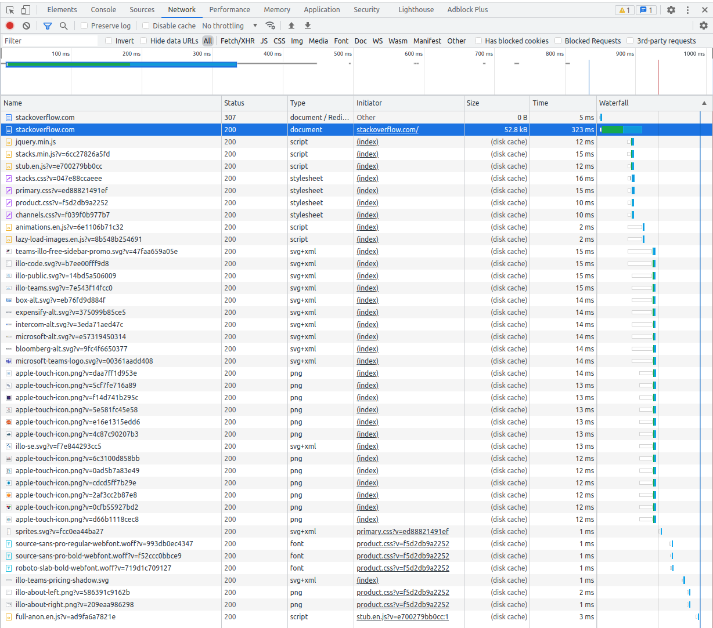

# Результат выполнения домашнего задания ["3.6. Компьютерные сети, лекция 1"](https://github.com/netology-code/sysadm-homeworks/blob/devsys10/03-sysadmin-06-net)

1. Работа c HTTP через телнет.

```shell
vagrant@vagrant:~$ telnet stackoverflow.com 80
Trying 151.101.1.69...
Connected to stackoverflow.com.
Escape character is '^]'.
GET /questions HTTP/1.0
HOST: stackoverflow.com

HTTP/1.1 301 Moved Permanently
cache-control: no-cache, no-store, must-revalidate
location: https://stackoverflow.com/questions
x-request-guid: 6ba5c6c0-bb36-47e0-8602-b2b3d719ae2a
feature-policy: microphone 'none'; speaker 'none'
content-security-policy: upgrade-insecure-requests; frame-ancestors 'self' https://stackexchange.com
Accept-Ranges: bytes
Date: Wed, 18 May 2022 14:20:38 GMT
Via: 1.1 varnish
Connection: close
X-Served-By: cache-ams21023-AMS
X-Cache: MISS
X-Cache-Hits: 0
X-Timer: S1652883638.975134,VS0,VE75
Vary: Fastly-SSL
X-DNS-Prefetch-Control: off
Set-Cookie: prov=b63d2df6-73f1-46c5-df8a-ef6a2ec97640; domain=.stackoverflow.com; expires=Fri, 01-Jan-2055 00:00:00 GMT; path=/; HttpOnly

Connection closed by foreign host.
```

В ответе приходит `301` код, который означает перемещение с запрошенной страницы

2. Повторите задание 1 в браузере, используя консоль разработчика F12.

Код ответа при заходе на сайт `Status Code: 307 Internal Redirect`.
Наиболее долгий по загрузке запрос - это запрос на загрузку самой страницы после редиректа (`https://stackoverflow.com/`).

Скриншот консоли браузера:


3. Какой IP адрес у вас в интернете?

Для того, чтобы узнать адрес можно воспользоваться запросом к онлайн сервисам, например `https://ifconfig.me`

```shell
vagrant@vagrant:~$ curl https://ifconfig.me

46.181.205.122
```

Ответ: 46.181.205.122.

4. Какому провайдеру принадлежит ваш IP адрес? Какой автономной системе AS? Воспользуйтесь утилитой `whois`

```shell
whois 46.181.205.122

<...>

% Information related to '46.181.192.0/18AS39927'

route:          46.181.192.0/18
descr:          Goodline.info
origin:         AS39927
mnt-by:         ELT-MNT
created:        2010-12-22T11:28:33Z
last-modified:  2010-12-22T11:28:33Z
source:         RIPE

% This query was served by the RIPE Database Query Service version 1.103 (ANGUS)
```

Ответ: Провайдер `Goodline.info`. AS `AS39927`

5. Через какие сети проходит пакет, отправленный с вашего компьютера на адрес 8.8.8.8? Через какие AS?

Для начала нужно установить саму утилиту через `sudo apt install traceroute`

Ответ: 

```shell
vagrant@vagrant:~$ traceroute -A 8.8.8.8
traceroute to 8.8.8.8 (8.8.8.8), 30 hops max, 60 byte packets
 1  10.0.2.2 (10.0.2.2) [*]  0.394 ms  0.240 ms  0.433 ms
 2  _gateway (192.168.1.1) [*]  5.169 ms  5.073 ms  4.981 ms
 3  46-181-220-33.len-65-kmr-cr01-6500.net.elt (46.181.220.33) [AS39927]  5.806 ms  5.710 ms  5.621 ms
 4  172.16.20.81 (172.16.20.81) [*]  5.534 ms  5.447 ms  5.351 ms
 5  172.16.22.169 (172.16.22.169) [*]  6.396 ms  6.312 ms  6.228 ms
 6  host_91_221_180_4.milecom.ru (91.221.180.4) [AS13094]  49.554 ms  51.691 ms  51.461 ms
 7  108.170.250.66 (108.170.250.66) [AS15169]  50.651 ms 108.170.250.34 (108.170.250.34) [AS15169]  53.738 ms 108.170.250.99 (108.170.250.99) [AS15169]  53.239 ms
 8  209.85.255.136 (209.85.255.136) [AS15169]  73.098 ms  78.774 ms 142.251.238.82 (142.251.238.82) [AS15169]  71.754 ms
 9  172.253.66.108 (172.253.66.108) [AS15169]  71.549 ms 142.251.237.142 (142.251.237.142) [AS15169]  83.762 ms 142.250.235.62 (142.250.235.62) [AS15169]  67.238 ms
10  172.253.51.187 (172.253.51.187) [AS15169]  60.195 ms 172.253.51.249 (172.253.51.249) [AS15169]  68.020 ms 216.239.42.23 (216.239.42.23) [AS15169]  67.761 ms
11  * * *
12  * * *
13  * * *
14  * * *
15  * * *
16  * * *
17  * * *
18  * * *
19  * * *
20  * * *
21  dns.google (8.8.8.8) [AS15169]  67.861 ms *  66.443 ms
```

6. Повторите задание 5 в утилите `mtr`. На каком участке наибольшая задержка - delay?

```shell
vagrant@vagrant:~$ mtr -w 8.8.8.8
Start: 2022-05-18T14:39:39+0000
HOST: vagrant                                    Loss%   Snt   Last   Avg  Best  Wrst StDev
  1.|-- 10.0.2.2                                    0.0%    10    0.9   0.8   0.4   1.1   0.2
  2.|-- _gateway                                    0.0%    10   23.7   5.9   2.1  23.7   6.4
  3.|-- 46-181-220-33.len-65-kmr-cr01-6500.net.elt  0.0%    10    4.2  15.5   2.9 115.9  35.3
  4.|-- 172.16.20.81                                0.0%    10    3.9   4.4   3.8   6.3   0.8
  5.|-- 172.16.22.169                               0.0%    10    3.8   4.1   3.5   5.6   0.7
  6.|-- host_91_221_180_4.milecom.ru                0.0%    10   49.1  49.7  48.4  51.9   1.1
  7.|-- 108.170.250.34                              0.0%    10   54.6  55.2  54.6  55.8   0.4
  8.|-- 172.253.66.116                              0.0%    10   75.9  76.2  75.8  77.4   0.5
  9.|-- 72.14.235.69                                0.0%    10   66.8  67.3  66.6  68.8   0.8
 10.|-- 172.253.79.237                              0.0%    10   66.7  67.5  66.4  70.2   1.2
 11.|-- ???                                        100.0    10    0.0   0.0   0.0   0.0   0.0
 12.|-- ???                                        100.0    10    0.0   0.0   0.0   0.0   0.0
 13.|-- ???                                        100.0    10    0.0   0.0   0.0   0.0   0.0
 14.|-- ???                                        100.0    10    0.0   0.0   0.0   0.0   0.0
 15.|-- ???                                        100.0    10    0.0   0.0   0.0   0.0   0.0
 16.|-- ???                                        100.0    10    0.0   0.0   0.0   0.0   0.0
 17.|-- ???                                        100.0    10    0.0   0.0   0.0   0.0   0.0
 18.|-- ???                                        100.0    10    0.0   0.0   0.0   0.0   0.0
 19.|-- ???                                        100.0    10    0.0   0.0   0.0   0.0   0.0
 20.|-- dns.google                                  0.0%    10   70.0  70.7  69.9  73.1   1.1
 ```

 Ответ: наибольшая задержка на 3-м хопе с показателем `Wrst` - 115.9 ms

 7. Какие DNS сервера отвечают за доменное имя dns.google? Какие A записи?

 ```shell
 vagrant@vagrant:~$ dig dns.google

; <<>> DiG 9.16.1-Ubuntu <<>> dns.google
;; global options: +cmd
;; Got answer:
;; ->>HEADER<<- opcode: QUERY, status: NOERROR, id: 21484
;; flags: qr rd ra; QUERY: 1, ANSWER: 2, AUTHORITY: 0, ADDITIONAL: 1

;; OPT PSEUDOSECTION:
; EDNS: version: 0, flags:; udp: 65494
;; QUESTION SECTION:
;dns.google.                    IN      A

;; ANSWER SECTION:
dns.google.             46      IN      A       8.8.4.4
dns.google.             46      IN      A       8.8.8.8

;; Query time: 8 msec
;; SERVER: 127.0.0.53#53(127.0.0.53)
;; WHEN: Wed May 18 14:45:56 UTC 2022
;; MSG SIZE  rcvd: 71
```

Ответ: DNS сервера с ip-адресами `8.8.4.4` и `8.8.8.8`, они оба являются `А` - записями.

8. Проверьте PTR записи для IP адресов из задания 7. Какое доменное имя привязано к IP?

```shell
vagrant@vagrant:~$ dig -x 8.8.4.4

; <<>> DiG 9.16.1-Ubuntu <<>> -x 8.8.4.4
;; global options: +cmd
;; Got answer:
;; ->>HEADER<<- opcode: QUERY, status: NOERROR, id: 18855
;; flags: qr rd ra; QUERY: 1, ANSWER: 1, AUTHORITY: 0, ADDITIONAL: 1

;; OPT PSEUDOSECTION:
; EDNS: version: 0, flags:; udp: 65494
;; QUESTION SECTION:
;4.4.8.8.in-addr.arpa.          IN      PTR

;; ANSWER SECTION:
4.4.8.8.in-addr.arpa.   64403   IN      PTR     dns.google.

;; Query time: 4 msec
;; SERVER: 127.0.0.53#53(127.0.0.53)
;; WHEN: Wed May 18 14:50:49 UTC 2022
;; MSG SIZE  rcvd: 73

vagrant@vagrant:~$ dig -x 8.8.8.8

; <<>> DiG 9.16.1-Ubuntu <<>> -x 8.8.8.8
;; global options: +cmd
;; Got answer:
;; ->>HEADER<<- opcode: QUERY, status: NOERROR, id: 53204
;; flags: qr rd ra; QUERY: 1, ANSWER: 1, AUTHORITY: 0, ADDITIONAL: 1

;; OPT PSEUDOSECTION:
; EDNS: version: 0, flags:; udp: 65494
;; QUESTION SECTION:
;8.8.8.8.in-addr.arpa.          IN      PTR

;; ANSWER SECTION:
8.8.8.8.in-addr.arpa.   6419    IN      PTR     dns.google.

;; Query time: 0 msec
;; SERVER: 127.0.0.53#53(127.0.0.53)
;; WHEN: Wed May 18 14:51:03 UTC 2022
;; MSG SIZE  rcvd: 73
```