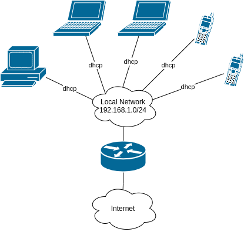

# Результат выполнения домашнего задания ["3.8. Компьютерные сети, лекция 3"](https://github.com/netology-code/sysadm-homeworks/blob/devsys10/03-sysadmin-08-net/README.md)

1. Подключитесь к публичному маршрутизатору в интернет. Найдите маршрут к вашему публичному IP
```
vagrant@vagrant:~$ telnet route-views.routeviews.org
Trying 128.223.51.103...
Connected to route-views.routeviews.org.
Escape character is '^]'.
C
**********************************************************************

                    RouteViews BGP Route Viewer
                    route-views.routeviews.org

 route views data is archived on http://archive.routeviews.org

 This hardware is part of a grant by the NSF.
 Please contact help@routeviews.org if you have questions, or
 if you wish to contribute your view.

 This router has views of full routing tables from several ASes.
 The list of peers is located at http://www.routeviews.org/peers
 in route-views.oregon-ix.net.txt

 NOTE: The hardware was upgraded in August 2014.  If you are seeing
 the error message, "no default Kerberos realm", you may want to
 in Mac OS X add "default unset autologin" to your ~/.telnetrc

 To login, use the username "rviews".

 **********************************************************************

User Access Verification

Username: rviews
route-views>show ip route 46.181.205.122
Routing entry for 46.180.0.0/15
  Known via "bgp 6447", distance 20, metric 0
  Tag 2497, type external
  Last update from 202.232.0.2 3w5d ago
  Routing Descriptor Blocks:
  * 202.232.0.2, from 202.232.0.2, 3w5d ago
      Route metric is 0, traffic share count is 1
      AS Hops 3
      Route tag 2497
      MPLS label: none
route-views>show bgp 46.181.205.122
BGP routing table entry for 46.180.0.0/15, version 2054594032
Paths: (24 available, best #19, table default)
  Not advertised to any peer
  Refresh Epoch 1
  53767 174 31133 39927, (aggregated by 65423 192.168.21.211)
    162.251.163.2 from 162.251.163.2 (162.251.162.3)
      Origin IGP, localpref 100, valid, external, atomic-aggregate
      Community: 174:21101 174:22005 53767:5000
      path 7FE045C32198 RPKI State not found
      rx pathid: 0, tx pathid: 0
  Refresh Epoch 1
  3561 3910 3356 3216 39927 39927, (aggregated by 65423 192.168.21.211)
    206.24.210.80 from 206.24.210.80 (206.24.210.80)
      Origin IGP, localpref 100, valid, external, atomic-aggregate
      path 7FE0DB9B0258 RPKI State not found
      rx pathid: 0, tx pathid: 0

<...>
```
2. Создайте dummy0 интерфейс в Ubuntu. Добавьте несколько статических маршрутов. Проверьте таблицу маршрутизации.

Создание `dummy`-интерфейса:
```shell
vagrant@vagrant:~$ echo "dummy" | sudo tee -a /etc/modules
dummy
vagrant@vagrant:~$ sudo touch /etc/modprobe.d/dummy.conf
vagrant@vagrant:~$ echo "options dummy numdummies=1" | sudo tee /etc/modprobe.d/dummy.conf
options dummy numdummies=1
vagrant@vagrant:~$ sudo ip link add dummy0 type dummy
```

Добавление маршрутов и отображение таблицы маршрутизации:
```shell
vagrant@vagrant:~$ sudo ip route add 10.2.2.4/32 via 10.0.3.16
vagrant@vagrant:~$ ip route
default via 10.0.2.2 dev eth0 proto dhcp src 10.0.2.15 metric 100 
10.0.2.0/24 dev eth0 proto kernel scope link src 10.0.2.15 
10.0.2.2 dev eth0 proto dhcp scope link src 10.0.2.15 metric 100 
10.2.2.3 dev eth0 scope link 
10.2.2.4 via 10.0.2.16 dev eth0 
```

3. Проверьте открытые `TCP` порты в Ubuntu, какие протоколы и приложения используют эти порты? Приведите несколько примеров.

Для отображения портов можно воспользоваться утилитой `ss` с флагами `-tln` - отобразить только TCP-порты в состоянии `LISTEN` (открыты для прослушивания), с числовым обозначением

```shell
vagrant@vagrant:~$ ss -tl
State              Recv-Q             Send-Q                         Local Address:Port                           Peer Address:Port            Process             
LISTEN             0                  4096                           127.0.0.53%lo:domain                              0.0.0.0:*                                   
LISTEN             0                  128                                  0.0.0.0:ssh                                 0.0.0.0:*                                   
LISTEN             0                  128                                     [::]:ssh                                    [::]:* 
```

Видим порты для `ssh` - `22` и порт `53`для [system-resolver](https://www.freedesktop.org/software/systemd/man/systemd-resolved.service.html)

4. Проверьте используемые `UDP` сокеты в Ubuntu, какие протоколы и приложения используют эти порты?

По аналогии с предыдущим заданием используем утилиту `ss`, заменив один из флагов `t` на `u`

```shell
vagrant@vagrant:~$ ss -uln
State              Recv-Q             Send-Q                          Local Address:Port                         Peer Address:Port             Process             
UNCONN             0                  0                               127.0.0.53%lo:53                                0.0.0.0:*                                    
UNCONN             0                  0                              10.0.2.15%eth0:68                                0.0.0.0:*                                    
```

`53` порт уже был в прошлом задании [system-resolver](https://www.freedesktop.org/software/systemd/man/systemd-resolved.service.html). `68` порт используется для [DHCP](https://en.wikipedia.org/wiki/Dynamic_Host_Configuration_Protocol)

5. Используя diagrams.net, создайте L3 диаграмму вашей домашней сети или любой другой сети, с которой вы работали.

Пример домашней сети с WiFi-роутером:

Файл [L3_network.xml](L3_network.xml) для открытия в [diagrams.net](https://diagrams.net).


