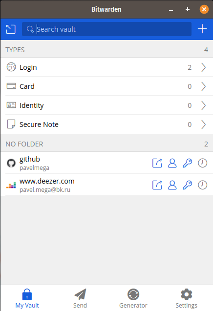
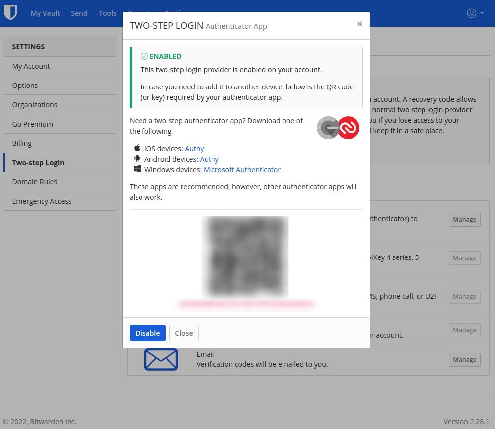
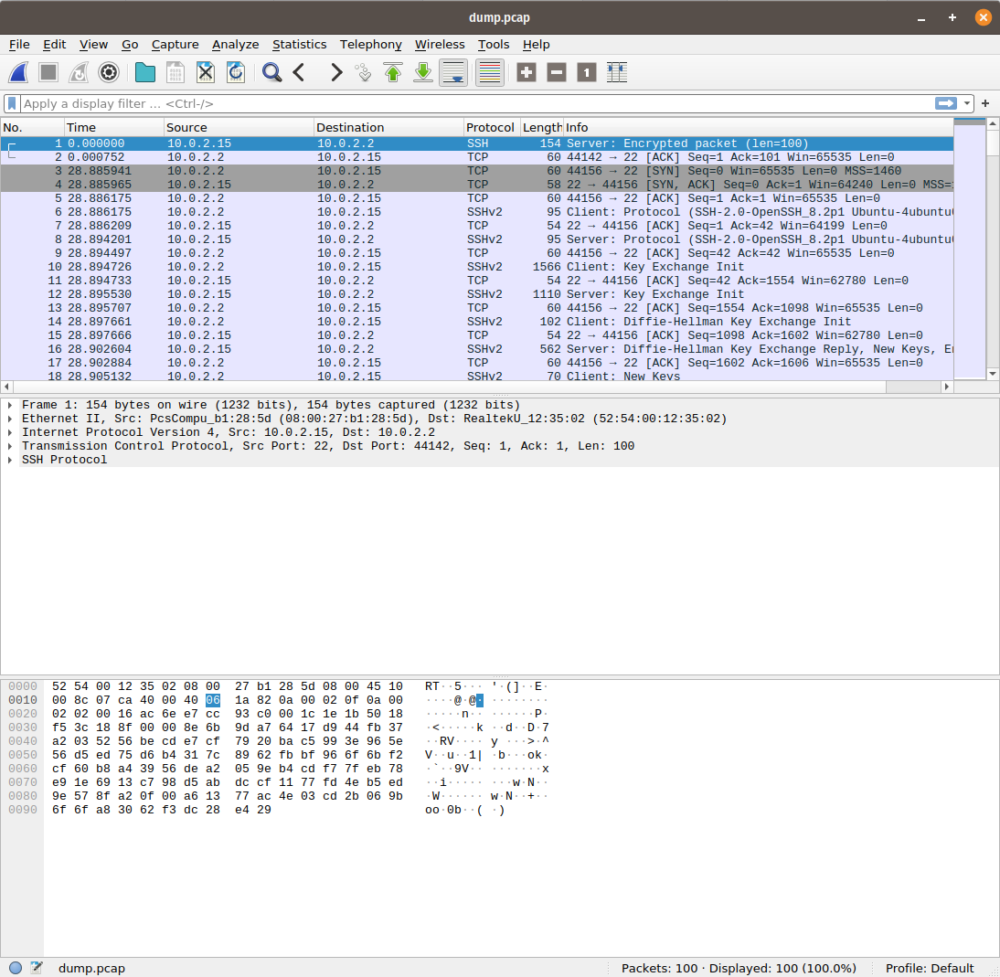

# Результат выполнения домашнего задания ["3.9. Элементы безопасности информационных систем"](https://github.com/netology-code/sysadm-homeworks/tree/devsys10/03-sysadmin-09-security)

1. Установите Bitwarden плагин для браузера. Зарегестрируйтесь и сохраните несколько паролей.



2. Установите Google authenticator на мобильный телефон. Настройте вход в Bitwarden акаунт через Google authenticator OTP



3. Установите `apache2`, сгенерируйте самоподписанный сертификат, настройте тестовый сайт для работы по `HTTPS`.

Вместо `apache2` можно использовать `nginx`

Установка:
```shell
vagrant@vagrant:~$ sudo apt install nginx
```

Проверим, что `nginx` запущен:
```shell
vagrant@vagrant:~$ sudo service nginx status
● nginx.service - A high performance web server and a reverse proxy server
     Loaded: loaded (/lib/systemd/system/nginx.service; enabled; vendor preset: enabled)
     Active: active (running) since Tue 2022-05-24 02:51:21 UTC; 32s ago
       Docs: man:nginx(8)
   Main PID: 42147 (nginx)
      Tasks: 3 (limit: 1071)
     Memory: 6.1M
     CGroup: /system.slice/nginx.service
             ├─42147 nginx: master process /usr/sbin/nginx -g daemon on; master_process on;
             ├─42148 nginx: worker process
             └─42149 nginx: worker process

May 24 02:51:21 vagrant systemd[1]: Starting A high performance web server and a reverse proxy server...
May 24 02:51:21 vagrant systemd[1]: Started A high performance web server and a reverse proxy server.
```

Сделаем запрос на 80-й порт локалхоста, чтобы проверить, что `nginx` принимает соединение
```shell
vagrant@vagrant:~$ curl -v http://localhost:80
*   Trying 127.0.0.1:80...
* TCP_NODELAY set
* Connected to localhost (127.0.0.1) port 80 (#0)
> GET / HTTP/1.1
> Host: localhost
> User-Agent: curl/7.68.0
> Accept: */*
> 
* Mark bundle as not supporting multiuse
< HTTP/1.1 200 OK
< Server: nginx/1.18.0 (Ubuntu)
< Date: Tue, 24 May 2022 02:55:28 GMT
< Content-Type: text/html
< Content-Length: 612
< Last-Modified: Tue, 24 May 2022 02:51:19 GMT
< Connection: keep-alive
< ETag: "628c4827-264"
< Accept-Ranges: bytes
< 
<!DOCTYPE html>
<html>
<head>
<title>Welcome to nginx!</title>
<style>
    body {
        width: 35em;
        margin: 0 auto;
        font-family: Tahoma, Verdana, Arial, sans-serif;
    }
</style>
</head>
<body>
<h1>Welcome to nginx!</h1>
<p>If you see this page, the nginx web server is successfully installed and
working. Further configuration is required.</p>

<p>For online documentation and support please refer to
<a href="http://nginx.org/">nginx.org</a>.<br/>
Commercial support is available at
<a href="http://nginx.com/">nginx.com</a>.</p>

<p><em>Thank you for using nginx.</em></p>
</body>
</html>
* Connection #0 to host localhost left intact
```
Далее сгенерируем сертификат:
```shell
vagrant@vagrant:~$ sudo openssl req -x509 -nodes -days 365 -newkey rsa:2048 \
>   -keyout /etc/ssl/private/nginx-selfsigned.key \
>   -out /etc/ssl/certs/nginx-selfsigned.crt \
>   -subj "/C=RU/ST=Moscow/L=Moscow/O=Company Name/OU=Org/CN=site.localhost"
Generating a RSA private key
...............+++++
................+++++
writing new private key to '/etc/ssl/private/nginx-selfsigned.key'

vagrant@vagrant:~$ sudo ls -lah /etc/ssl/private/ | grep nginx
-rw------- 1 root root 1.7K May 24 02:58 nginx-selfsigned.key

vagrant@vagrant:~$ sudo ls -lah /etc/ssl/certs/ | grep nginx
-rw-r--r-- 1 root root 1.4K May 24 02:58 nginx-selfsigned.crt
```

Воспользуемся [конфигуратором](https://ssl-config.mozilla.org/#server=nginx&version=1.18&config=modern&openssl=1.1.1k&guideline=5.6) из вебинара и сформируем конфигурацию для `nginx` Modern, где укажем название нашего сайта и укажем корректные пути до сертификатов и расположим в директории с конфигурациями доступных сайтов `/etc/nginx/sites-available`:

```
server {
    listen 443 ssl http2;
    listen [::]:443 ssl http2;
    server_name site.localhost;

    ssl_certificate /etc/ssl/certs/nginx-selfsigned.crt;
    ssl_certificate_key /etc/ssl/private/nginx-selfsigned.key;
    ssl_session_timeout 1d;
    ssl_session_cache shared:MozSSL:10m;  # about 40000 sessions
    ssl_session_tickets off;

    # modern configuration
    ssl_protocols TLSv1.3;
    ssl_prefer_server_ciphers off;

    # HSTS (ngx_http_headers_module is required) (63072000 seconds)
    add_header Strict-Transport-Security "max-age=63072000" always;

    # OCSP stapling
    ssl_stapling on;
    ssl_stapling_verify on;

    location / {
        root /var/www/html;
        index index.html index.htm;
    }
}
```

После сделаем эту конфигурацию активной через ссылку и проверим, что она корректна:
```shell
vagrant@vagrant:~$ sudo ln -s /etc/nginx/sites-available/localhost_ssl.conf /etc/nginx/sites-enabled/localhost_ssl.conf

vagrant@vagrant:/etc/nginx/sites-available$ sudo nginx -t
nginx: [warn] "ssl_stapling" ignored, issuer certificate not found for certificate "/etc/ssl/certs/nginx-selfsigned.crt"
nginx: the configuration file /etc/nginx/nginx.conf syntax is ok
nginx: configuration file /etc/nginx/nginx.conf test is successful
```

Выполним перезапуск 'nginx' и проверим, что всё хорошо:

```shell
vagrant@vagrant:/etc/nginx/sites-available$ sudo service nginx restart
vagrant@vagrant:/etc/nginx/sites-available$ sudo service nginx status
● nginx.service - A high performance web server and a reverse proxy server
     Loaded: loaded (/lib/systemd/system/nginx.service; enabled; vendor preset: enabled)
     Active: active (running) since Tue 2022-05-24 03:13:40 UTC; 3s ago
       Docs: man:nginx(8)
    Process: 42312 ExecStartPre=/usr/sbin/nginx -t -q -g daemon on; master_process on; (code=exited, status=0/SUCCESS)
    Process: 42323 ExecStart=/usr/sbin/nginx -g daemon on; master_process on; (code=exited, status=0/SUCCESS)
   Main PID: 42324 (nginx)
      Tasks: 3 (limit: 1071)
     Memory: 3.5M
     CGroup: /system.slice/nginx.service
             ├─42324 nginx: master process /usr/sbin/nginx -g daemon on; master_process on;
             ├─42325 nginx: worker process
             └─42326 nginx: worker process
```

Сделаем запрос через `curl` на `https` с игнорированием ошибок самоподписанного сертификата:
```shell
vagrant@vagrant:~$ curl -k https://site.localhost --resolve 'site.localhost:127.0.0.1'
<!DOCTYPE html>
<html>
<head>
<title>Welcome to nginx!</title>
<style>
    body {
        width: 35em;
        margin: 0 auto;
        font-family: Tahoma, Verdana, Arial, sans-serif;
    }
</style>
</head>
<body>
<h1>Welcome to nginx!</h1>
<p>If you see this page, the nginx web server is successfully installed and
working. Further configuration is required.</p>

<p>For online documentation and support please refer to
<a href="http://nginx.org/">nginx.org</a>.<br/>
Commercial support is available at
<a href="http://nginx.com/">nginx.com</a>.</p>

<p><em>Thank you for using nginx.</em></p>
</body>
</html>
``` 

4. Проверьте на TLS уязвимости произвольный сайт в интернете (кроме сайтов МВД, ФСБ, МинОбр, НацБанк, РосКосмос, РосАтом, РосНАНО и любых госкомпаний, объектов КИИ, ВПК ... и тому подобное).

```shell
vagrant@vagrant:~$ git clone --depth 1 https://github.com/drwetter/testssl.sh.git
Cloning into 'testssl.sh'...
remote: Enumerating objects: 102, done.
remote: Counting objects: 100% (102/102), done.
remote: Compressing objects: 100% (93/93), done.
remote: Total 102 (delta 15), reused 28 (delta 8), pack-reused 0
Receiving objects: 100% (102/102), 8.54 MiB | 3.17 MiB/s, done.
Resolving deltas: 100% (15/15), done.

vagrant@vagrant:~$ cd testssl.sh/

vagrant@vagrant:~/testssl.sh$ ./testssl.sh -U --sneaky ya.ru

###########################################################
    testssl.sh       3.1dev from https://testssl.sh/dev/
    (d931eb4 2022-05-14 13:57:46)

      This program is free software. Distribution and
             modification under GPLv2 permitted.
      USAGE w/o ANY WARRANTY. USE IT AT YOUR OWN RISK!

       Please file bugs @ https://testssl.sh/bugs/

###########################################################

 Using "OpenSSL 1.0.2-chacha (1.0.2k-dev)" [~183 ciphers]
 on vagrant:./bin/openssl.Linux.x86_64
 (built: "Jan 18 17:12:17 2019", platform: "linux-x86_64")


 Start 2022-05-24 03:32:00        -->> 87.250.250.242:443 (ya.ru) <<--

 Further IP addresses:   2a02:6b8::2:242 
 rDNS (87.250.250.242):  ya.ru.
 Service detected:       HTTP


 Testing vulnerabilities 

 Heartbleed (CVE-2014-0160)                not vulnerable (OK), no heartbeat extension
 CCS (CVE-2014-0224)                       not vulnerable (OK)
 Ticketbleed (CVE-2016-9244), experiment.  not vulnerable (OK)
 ROBOT                                     not vulnerable (OK)
 Secure Renegotiation (RFC 5746)           supported (OK)
 Secure Client-Initiated Renegotiation     not vulnerable (OK)
 CRIME, TLS (CVE-2012-4929)                not vulnerable (OK)
 BREACH (CVE-2013-3587)                    potentially NOT ok, "gzip" HTTP compression detected. - only supplied "/" tested
                                           Can be ignored for static pages or if no secrets in the page
 POODLE, SSL (CVE-2014-3566)               not vulnerable (OK)
 TLS_FALLBACK_SCSV (RFC 7507)              Downgrade attack prevention supported (OK)
 SWEET32 (CVE-2016-2183, CVE-2016-6329)    VULNERABLE, uses 64 bit block ciphers
 FREAK (CVE-2015-0204)                     not vulnerable (OK)
 DROWN (CVE-2016-0800, CVE-2016-0703)      not vulnerable on this host and port (OK)
                                           make sure you don't use this certificate elsewhere with SSLv2 enabled services, see
                                           https://search.censys.io/search?resource=hosts&virtual_hosts=INCLUDE&q=9659D121304E46C0BF09A192A60D0682CC366788BAE86A2C3D0A451AB1CD79DF
 LOGJAM (CVE-2015-4000), experimental      not vulnerable (OK): no DH EXPORT ciphers, no DH key detected with <= TLS 1.2
 BEAST (CVE-2011-3389)                     TLS1: ECDHE-RSA-AES128-SHA AES128-SHA DES-CBC3-SHA 
                                           VULNERABLE -- but also supports higher protocols  TLSv1.1 TLSv1.2 (likely mitigated)
 LUCKY13 (CVE-2013-0169), experimental     potentially VULNERABLE, uses cipher block chaining (CBC) ciphers with TLS. Check patches
 Winshock (CVE-2014-6321), experimental    not vulnerable (OK)
 RC4 (CVE-2013-2566, CVE-2015-2808)        no RC4 ciphers detected (OK)


 Done 2022-05-24 03:32:41 [  43s] -->> 87.250.250.242:443 (ya.ru) <<--
```

5. Установите на Ubuntu ssh сервер, сгенерируйте новый приватный ключ. Скопируйте свой публичный ключ на другой сервер. Подключитесь к серверу по SSH-ключу.

На виртуальной машине уже установлен ssh-сервер и есть ключ для подключения к машине с хоста. Можно сгенерировать новый ключ для пользователя `vagrant` и подключится как `root`.

```shell

vagrant@vagrant:~$ ssh-keygen
Generating public/private rsa key pair.
Enter file in which to save the key (/home/vagrant/.ssh/id_rsa):
Enter passphrase (empty for no passphrase):
Enter same passphrase again:
Your identification has been saved in /home/vagrant/.ssh/id_rsa
Your public key has been saved in /home/vagrant/.ssh/id_rsa.pub
The key fingerprint is:
SHA256:2pM4rwItRuETXkbt44slmXxc1naSofNyS93nMYQOpXc vagrant@vagrant
The key's randomart image is:
+---[RSA 3072]----+
|   ...           |
|  o o .   .  .   |
| o = .   o oo .  |
|  =   o = =o.o E |
| . + = +S+ ++.o  |
|  + * =+..+ ...o.|
| . o =+.++ .   oo|
|    o .o ..     .|
|     ....        |
+----[SHA256]-----+
```

Добавляем открытый ключ пользователю `root` и проверяем, что всё прошло успешно:
```shell
vagrant@vagrant:~$ cat .ssh/id_rsa.pub | sudo tee /root/.ssh/authorized_keys

vagrant@vagrant:~$ ssh -l root 127.0.0.1
Welcome to Ubuntu 20.04.4 LTS (GNU/Linux 5.4.0-91-generic x86_64)

 * Documentation:  https://help.ubuntu.com
 * Management:     https://landscape.canonical.com
 * Support:        https://ubuntu.com/advantage

  System information as of Tue 24 May 2022 03:41:35 AM UTC

  System load:  0.07               Processes:             135
  Usage of /:   13.3% of 30.88GB   Users logged in:       1
  Memory usage: 25%                IPv4 address for eth0: 10.0.2.15
  Swap usage:   0%


This system is built by the Bento project by Chef Software
More information can be found at https://github.com/chef/bento
Last login: Tue May 24 03:41:26 2022 from 127.0.0.1
root@vagrant:~# 
```

6. Переименуйте файлы ключей из задания 5. Настройте файл конфигурации `SSH` клиента, так чтобы вход на удаленный сервер осуществлялся по имени сервера.

```shell
vagrant@vagrant:~$ mv ~/.ssh/id_rsa ~/.ssh/renamed_key
vagrant@vagrant:~$ mv ~/.ssh/id_rsa.pub ~/.ssh/renamed_key.pub
```

Создадим конфигурацию в `~/.ssh/config`
```
host local-test
  hostname 127.0.0.1
  user root
  identityfile ~/.ssh/renamed_key
```

И проверим работоспособность:
```shell
vagrant@vagrant:~/.ssh$ ssh local-test
Welcome to Ubuntu 20.04.4 LTS (GNU/Linux 5.4.0-91-generic x86_64)

 * Documentation:  https://help.ubuntu.com
 * Management:     https://landscape.canonical.com
 * Support:        https://ubuntu.com/advantage

  System information as of Tue 24 May 2022 03:45:27 AM UTC

  System load:  0.0                Processes:             136
  Usage of /:   13.3% of 30.88GB   Users logged in:       1
  Memory usage: 25%                IPv4 address for eth0: 10.0.2.15
  Swap usage:   0%


This system is built by the Bento project by Chef Software
More information can be found at https://github.com/chef/bento
Last login: Tue May 24 03:41:36 2022 from 127.0.0.1
root@vagrant:~#
```

7. Соберите дамп трафика утилитой `tcpdump` в формате pcap, 100 пакетов. Откройте файл pcap в Wireshark.

```shell
vagrant@vagrant:~$ sudo tcpdump -c 100 -w dump.pcap
tcpdump: listening on eth0, link-type EN10MB (Ethernet), capture size 262144 bytes
100 packets captured
102 packets received by filter
0 packets dropped by kernel
```

Для просмотра, необходимо скачать на хост дамп и установить утилиту:
```shell
# копируем дамп
scp -P 2222 vagrant@127.0.0.1:/home/vagrant/dump.pcap ./dump.pcap
dump.cap                            100%   15KB  15.7MB/s   00:00

# устанавливаем wireshark
sudo apt install wireshark
```
Дамп в утилите:

